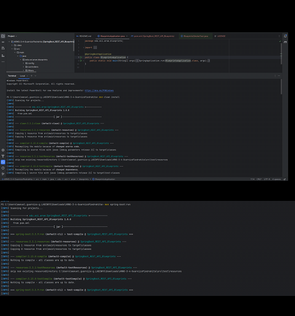
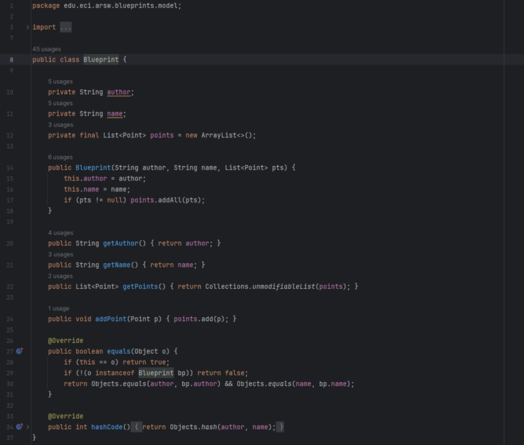

# ARWS-3-4-GuarnizoPiedrahita
Laboratorio 3 y 4 de Manuel Alejandro Guarnizo y Carlos Mario Piedrahita

## Lab3

### Parte 1

En esta clase dentro de la capa de modelo podemos ver que la clase principal 
Blueprint que probablemente se encargue de la logica de gran parte de la implementación