## Laboratorio #4 – REST API Blueprints (Java 21 / Spring Boot 3.3.x)
# Escuela Colombiana de Ingeniería – Arquitecturas de Software  

---

## 📋 Requisitos
- Java 21
- Maven 3.9+

## ▶️ Ejecución del proyecto
```bash
mvn clean install
mvn spring-boot:run
```
Probar con `curl`:
```bash
curl -s http://localhost:8080/blueprints | jq
curl -s http://localhost:8080/blueprints/john | jq
curl -s http://localhost:8080/blueprints/john/house | jq
curl -i -X POST http://localhost:8080/blueprints -H 'Content-Type: application/json' -d '{ "author":"john","name":"kitchen","points":[{"x":1,"y":1},{"x":2,"y":2}] }'
curl -i -X PUT  http://localhost:8080/blueprints/john/kitchen/points -H 'Content-Type: application/json' -d '{ "x":3,"y":3 }'
```

> Si deseas activar filtros de puntos (reducción de redundancia, *undersampling*, etc.), implementa nuevas clases que implementen `BlueprintsFilter` y cámbialas por `IdentityFilter` con `@Primary` o usando configuración de Spring.
---

Abrir en navegador:  
- Swagger UI: [http://localhost:8080/swagger-ui.html](http://localhost:8080/swagger-ui.html)  
- OpenAPI JSON: [http://localhost:8080/v3/api-docs](http://localhost:8080/v3/api-docs)  

---

## 🗂️ Estructura de carpetas (arquitectura)

```
src/main/java/edu/eci/arsw/blueprints
  ├── model/         # Entidades de dominio: Blueprint, Point
  ├── persistence/   # Interfaz + repositorios (InMemory, Postgres)
  │    └── impl/     # Implementaciones concretas
  ├── services/      # Lógica de negocio y orquestación
  ├── filters/       # Filtros de procesamiento (Identity, Redundancy, Undersampling)
  ├── controllers/   # REST Controllers (BlueprintsAPIController)
  └── config/        # Configuración (Swagger/OpenAPI, etc.)
```

> Esta separación sigue el patrón **capas lógicas** (modelo, persistencia, servicios, controladores), facilitando la extensión hacia nuevas tecnologías o fuentes de datos.

---

## 📖 Actividades del laboratorio

### 1. Familiarización con el código base
- Revisa el paquete `model` con las clases `Blueprint` y `Point`.  
  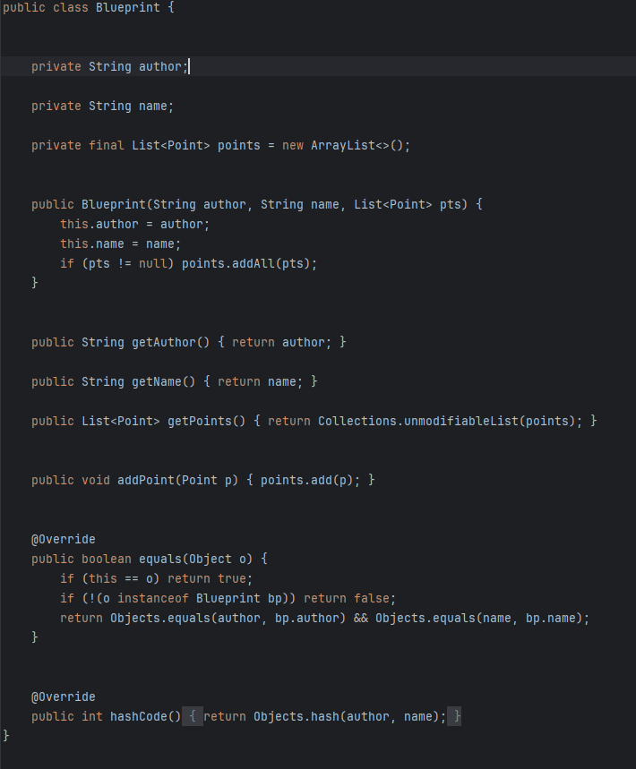
- Esta clase representa un diseño que contine una cantidad de puntos donde se puede tambien poner el autor y el nombre 
  del blueprint
- Cabe aclarar que los clientes no pueden modificar directamente la lista es por medio de usar cosas como unmodificable 
  en el metodo que permite obtener una vista de de la lista.
- tiene un metodo para añadir puntos que es la unica manera de cambiar la lista

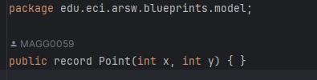
- Tambien tenemos la clase point que componet las lista de la clase blueprint esta clase punto tiene componentes
  x, y que podemos asumir represntan un posición

- Entiende la capa `persistence` con `InMemoryBlueprintPersistence`.  
  
- Esta clase es una implementación en memoria de la interfaz BlueprintPersistence. Actúa como un repositorio que 
  almacena los blueprints en un mapa concurrente en lugar de una base de datos.
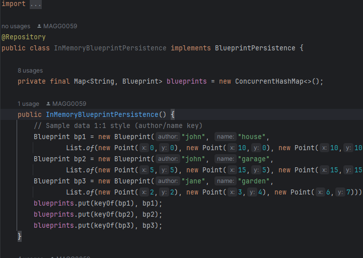
- @Repository: Spring la detecta como un bean de repositorio 
- ConcurrentHashMap: Proporciona seguridad en hilos (thread-safe)

- 
- Propósito: Generar una clave única combinando autor y nombre (separados por ":")


- 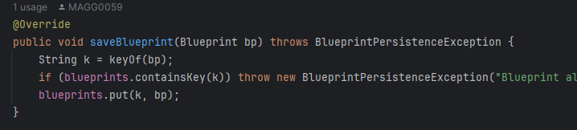
- Guarda un nuevo blueprint 
- Valida que no exista otro con mismo autor y nombre 
- Si ya existe, lanza BlueprintPersistenceException

- 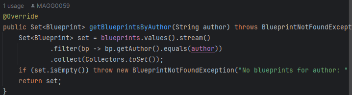
- Usa Stream API para filtrar blueprints por autor 
- Si el autor no tiene blueprints, lanza excepción
- Retorna un Set (sin duplicados)

- 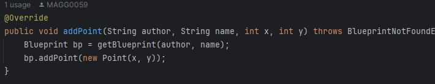
- Agrega un nuevo punto a un blueprint existente 
- Primero obtiene el blueprint (si no existe, lanza excepción)
- Luego usa el método addPoint del blueprint


- Analiza la capa `services` (`BlueprintsServices`) y el controlador `BlueprintsAPIController`.
- 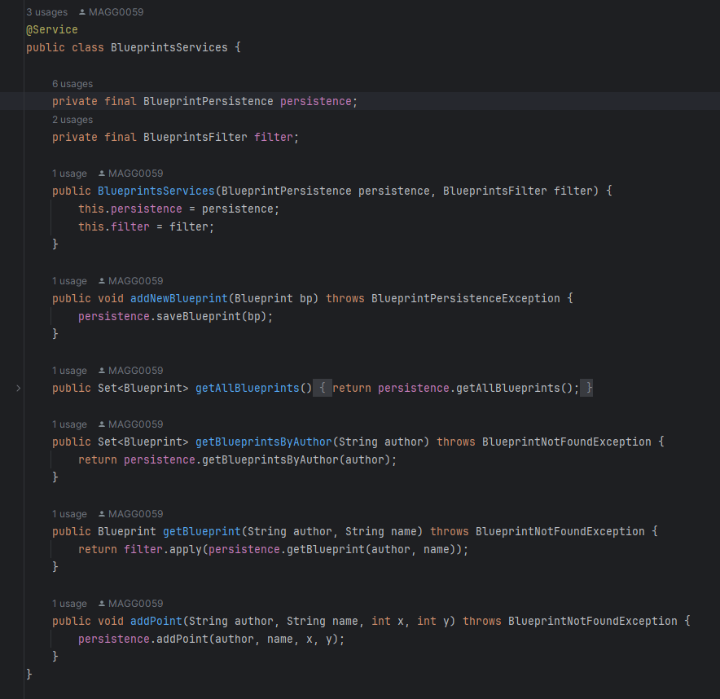
- El BlueprintServices es el encargado de coordinar lo que se pide desde
  el controlador hacia las acciones en la persistencia, ahi podemos ver
  como ver como llama directamente a la persistencia y en otras utilizando un filter
  con el fin de hacer de mejor manera las busquedas.

- 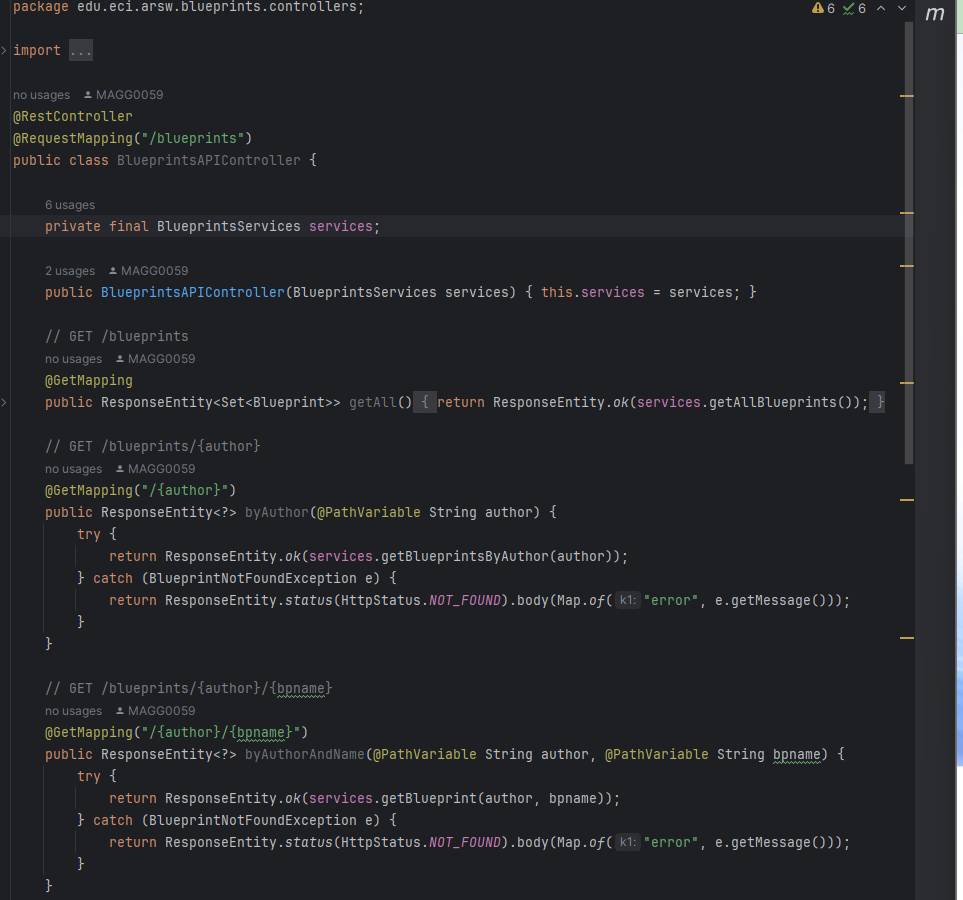
- Por ultimo tenemos el controlador de la API que es más de lo mismos metodos que ya habiamos 
  analizado vemos como el controller se comunica con los services según el metodo que debe ser
- 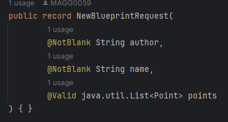
- Llama la antención tambien esta especie de DTO que es un record para las solicitudes

### 2. Migración a persistencia en PostgreSQL
- Configura una base de datos PostgreSQL (puedes usar Docker).
- Primero configuramos el docker-compose-yml
- 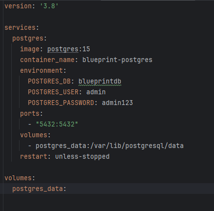
- Despues agregamos al pom el plugin de Postgres que nescesitamos 
- 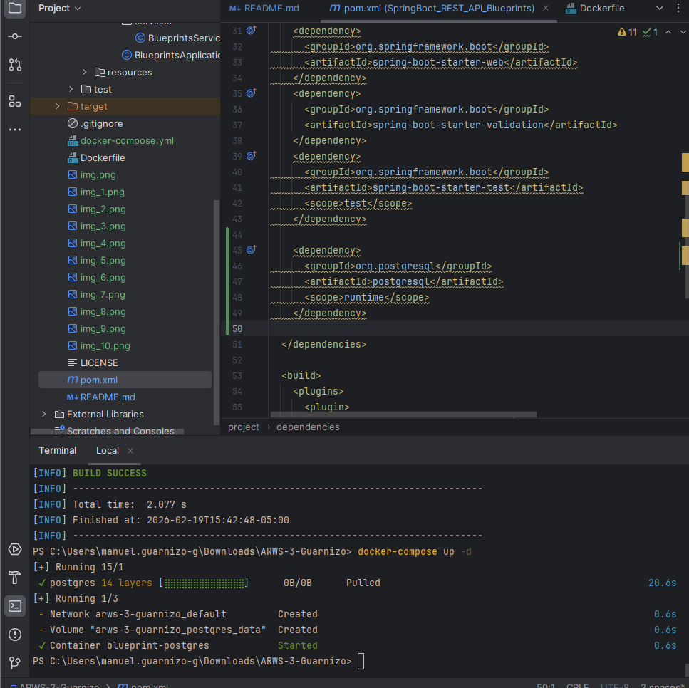
- Hacemos otras verificaciones
- 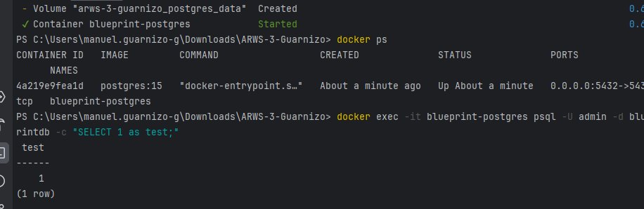

- Implementa un nuevo repositorio `PostgresBlueprintPersistence` que reemplace la versión en memoria. 
- 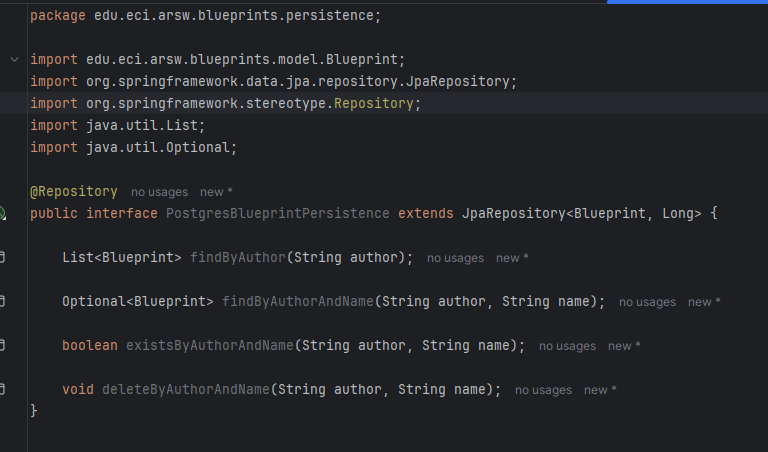
- esta podría ser una opción de PostgresBlueprintPersistence para reemplazar la de la memoria
- Mantén el contrato de la interfaz `BlueprintPersistence`.  
- ahora para mantener el contrato podemos poner esta:
- 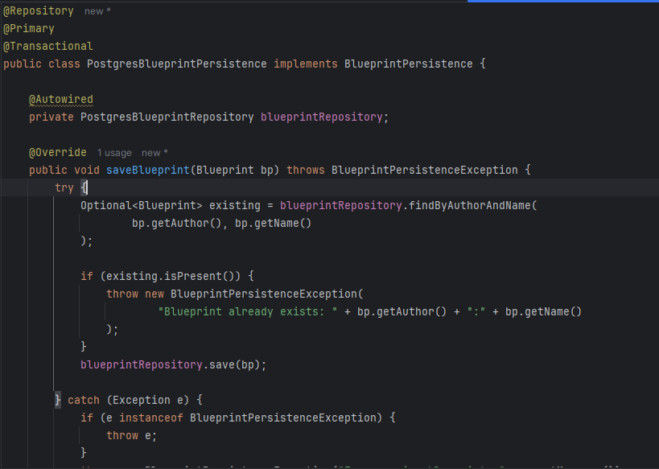
- 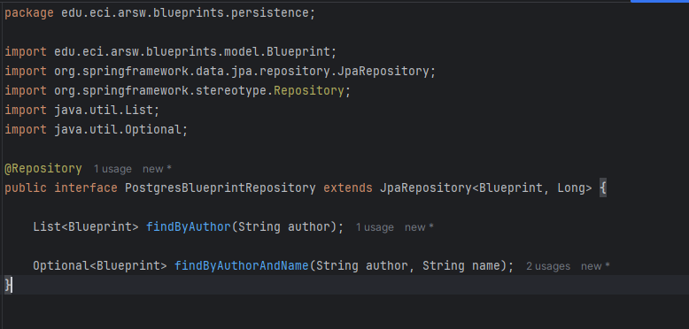

### 3. Buenas prácticas de API REST
- Cambia el path base de los controladores a `/api/v1/blueprints`.  
- Usa **códigos HTTP** correctos:  
  - `200 OK` (consultas exitosas).  
  - `201 Created` (creación).  
  - `202 Accepted` (actualizaciones).  
  - `400 Bad Request` (datos inválidos).  
  - `404 Not Found` (recurso inexistente).  
- Implementa una clase genérica de respuesta uniforme:
  ```java
  public record ApiResponse<T>(int code, String message, T data) {}
  ```
  Ejemplo JSON:
- 
  ```json
  {
    "code": 200,
    "message": "execute ok",
    "data": { "author": "john", "name": "house", "points": ["..."] }
  }
  ```
 - Implementamos el ApiResponse y modificamos el controller
   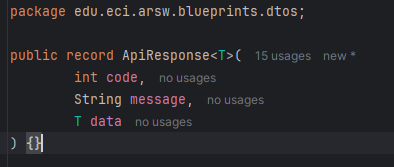
 - 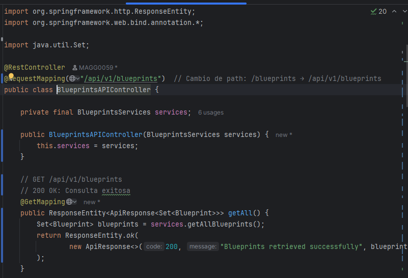

 - Ejemplos de uso:
 - 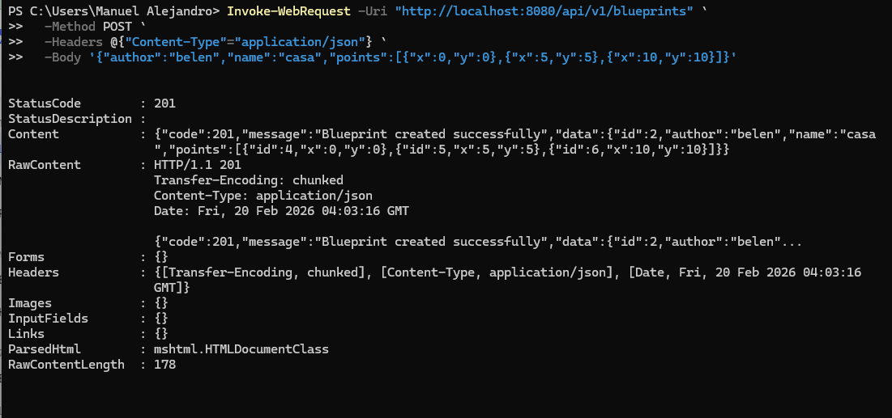
 - 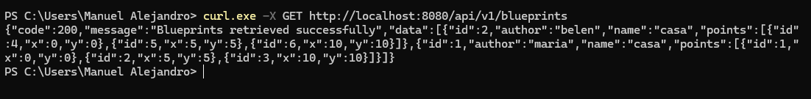
 - podemos verlo en la base de datos
 - 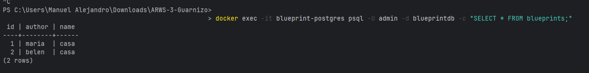


### 4. OpenAPI / Swagger
- Configura `springdoc-openapi` en el proyecto.  
- Expón documentación automática en `/swagger-ui.html`.  
- Anota endpoints con `@Operation` y `@ApiResponse`.

- Aca hay un ejemplo de como anotamos endpoints con operation o Api response
-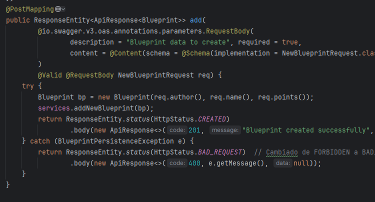
- A continuación exponemos la documentación automatica de swagger
- 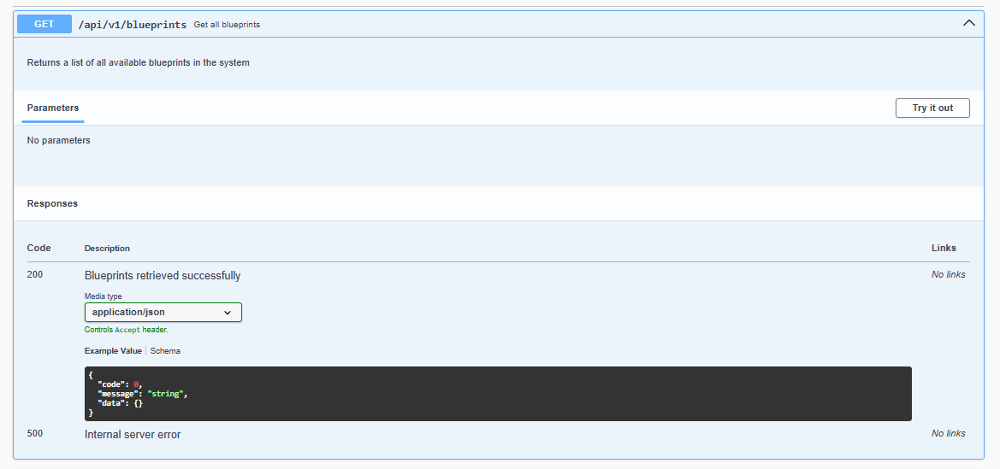
- 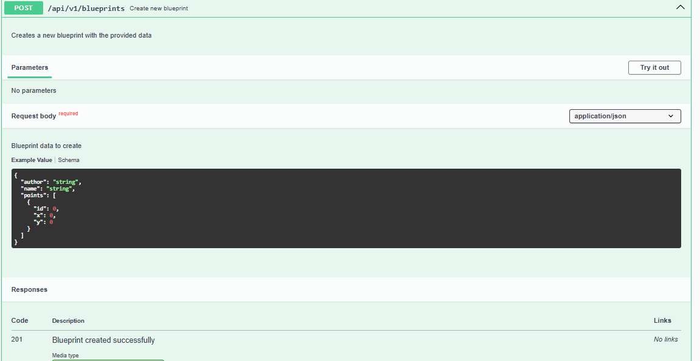
-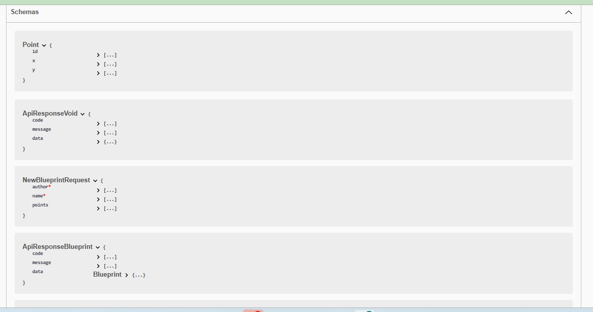
- Aca tenemos la documentación de los endpoints y de algunos esquemas

### 5. Filtros de *Blueprints*
- Implementa filtros:
  - **RedundancyFilter**: elimina puntos duplicados consecutivos.  
  - **UndersamplingFilter**: conserva 1 de cada 2 puntos.  
- Activa los filtros mediante perfiles de Spring (`redundancy`, `undersampling`).  
- 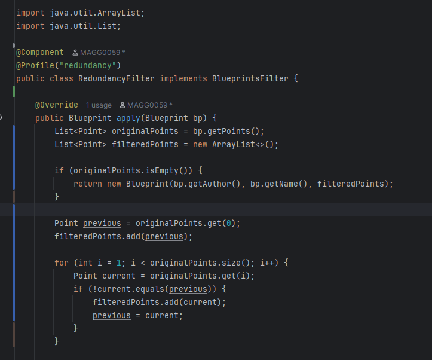
- Primero creamos el perfil de redundancia que nos va a ayudar con puntos duplicados
- 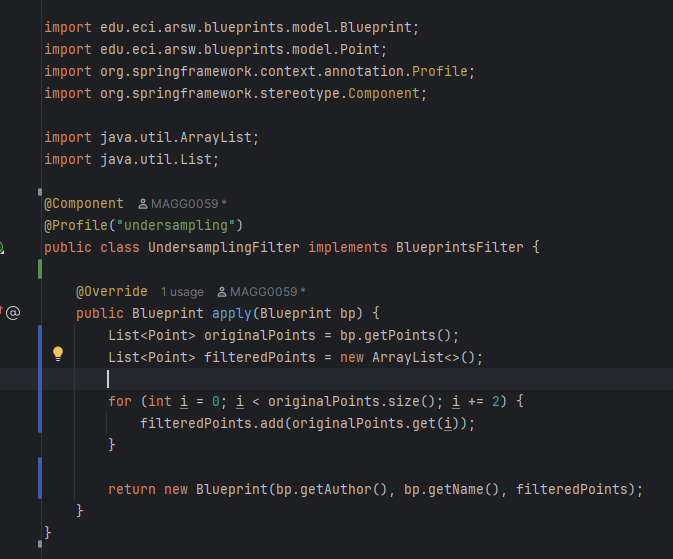
- Y el UndersamplingFilter que conserva 1 de cada 2
- 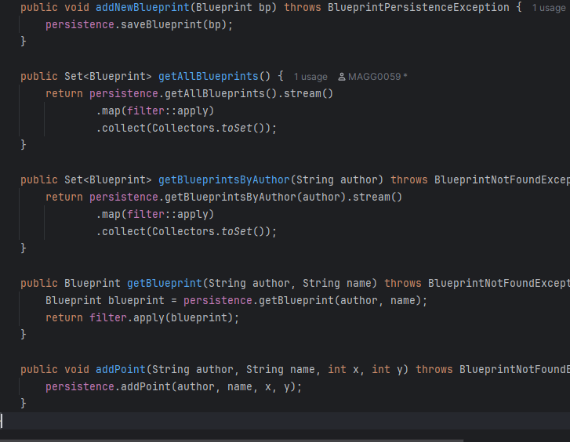
- modificamos el service
- 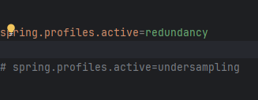
- En el properties lo ponemos para probar primero el filtro de redundancia
- y el ejemplo con redundancia queda asi:
- 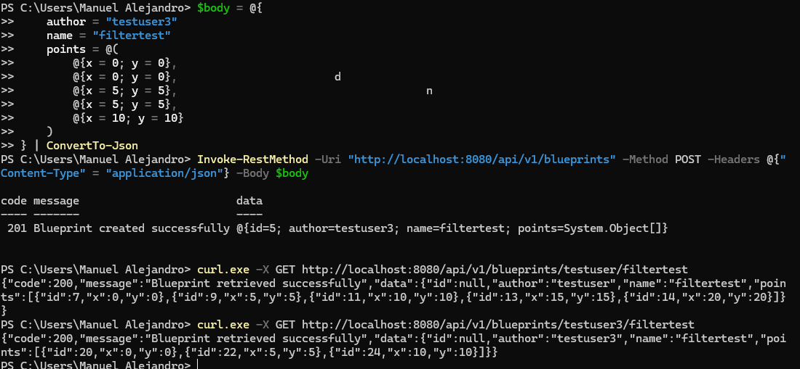
- como podemos ver  devuelve solo los tres sin repeticiones osea que el filtro funciona
- Ya para Undersamplingfilter
- 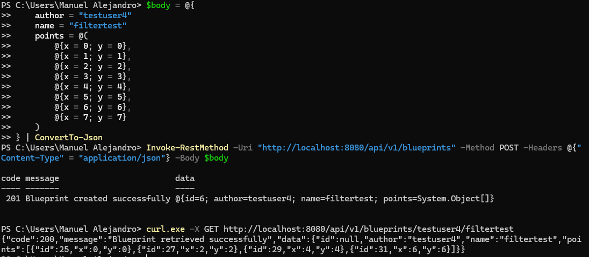
- Vemos como efectivamente va de 0,0 a 2,2  despues a 4,4 y asi como se le indica en el filtro

---

## ✅ Entregables

1. Repositorio en GitHub con:  
   - Código fuente actualizado.  
   - Configuración PostgreSQL (`application.yml` o script SQL).  
   - Swagger/OpenAPI habilitado.  
   - Clase `ApiResponse<T>` implementada.  

2. Documentación:  
   - Informe de laboratorio con instrucciones claras.  
   - Evidencia de consultas en Swagger UI y evidencia de mensajes en la base de datos.  
   - Breve explicación de buenas prácticas aplicadas.  

---

## 📊 Criterios de evaluación

| Criterio | Peso |
|----------|------|
| Diseño de API (versionamiento, DTOs, ApiResponse) | 25% |
| Migración a PostgreSQL (repositorio y persistencia correcta) | 25% |
| Uso correcto de códigos HTTP y control de errores | 20% |
| Documentación con OpenAPI/Swagger + README | 15% |
| Pruebas básicas (unitarias o de integración) | 15% |

**Bonus**:  

- Imagen de contenedor (`spring-boot:build-image`).  
- Métricas con Actuator.  